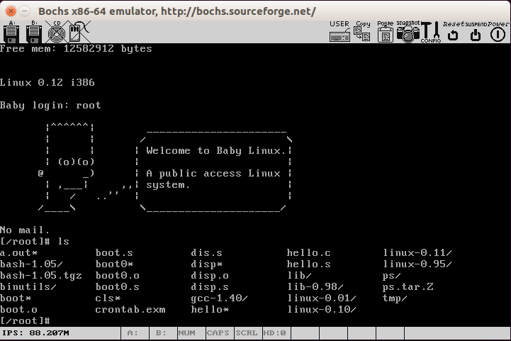

# 简介
本库克隆自sky-big,其中大部分注释源自该库，感谢其内容。本库用于个人学习Linux0.12版本的
内核。这个README是在原库README的基础上修改的，但原内容比较少，因此这里如要是增加了一些
内容，以便于学习。

# 学习环境
本库的源代码是Linux0.12版本的代码。具体调试和运行环境在本人办公用机进行，具体版本是
Ubuntu 16.04桌面版。其中编译环境是7.4.0。原作者在GCC 5.4.0 + Ubuntu 16.04可以编译通
过，但本人没有具体测试验证。但在本人上述环境是可以编译通过的。

# 编译源代码
源代码的编译非常简单，在本源代码根目录下输入make命令即可完成编译，完成后会输出相应而
二进制文件。

具体编译过程及结果如下:

# 运行

运行结果如下:

运行环境下载地址:
http://oldlinux.org/Linux.old/bochs/linux-0.12-080324.zip

