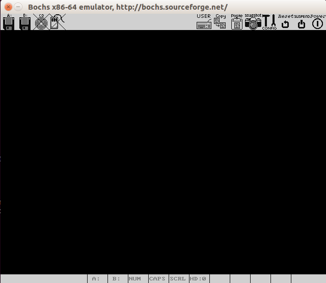
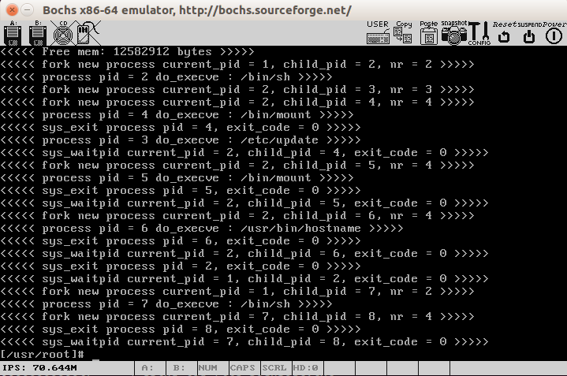

# 简介
本库克隆自sky-big,其中大部分注释源自该库，感谢其内容。本库用于个人学习Linux0.12版本的
内核。这个README是在原库README的基础上修改的，但原内容比较少，因此这里如要是增加了一些
内容，以便于学习。

# 学习环境
本库的源代码是Linux0.12版本的代码。具体调试和运行环境在本人办公用机进行，具体版本是
Ubuntu 16.04桌面版。其中编译环境是7.4.0。原作者在GCC 5.4.0 + Ubuntu 16.04可以编译通
过，但本人没有具体测试验证。但在本人上述环境是可以编译通过的。

本库中**增加了一个bochs目录**，这里是运行bochs需要的配置文件和镜像文件。其中比较有用的是
chsrc-0.12-hd.bxrc和bootimage-0.12-hd两个文件，这两个文件是运行bochs的配置文件和Linux
操作系统镜像文件。其中后者是可以被重新编译的镜像文件替换的，后面会提到这点。


# 编译源代码
源代码的编译非常简单，在本源代码根目录下输入make命令即可完成编译，完成后会输出相应而
二进制文件。

具体编译过程及结果如下:


完成编译后，其中最终可用的文件是Kernel_Image，这个文件是Linux内核的镜像。可以将文件
覆盖掉bochs目录中的bootimage-0.12-hd文件进行测试。也就是可以执行如下命令进行覆盖：
```
cp Kernel_Image bochs/bootimage-0.12-hd
```

# 运行
本库已经有一个预编译好的Linux镜像文件，可以切换到bochs目录下，直接执行如下命令，此时就
可以运行起一个bochs实例：
```
bochs -f bochsrc-0.12-hd.bxrc
```
开始运行的时候，会弹出一个新的窗口，这个就是bochs。您可能会看到如下窗口：


可能看到这里的窗口是黑色的，不要着急，这是因为bochs处于调试模式，目前中断在了某个地方。
这个时候可以切换会刚才启动命令的地方，在命令行中输入`c`,然后回车即可，此时bochs会继续
运行。

然后再切换会刚才的bochs窗口，可以看到大概如下内容。


此时，就可以进入bochs中的操作系统，输入您想输入的命令，比如`ls`等。


运行环境需要的完整资源可以从下面链接找到，**如果您是在Ubuntu下进行安装调试的，则不用关心
该链接**，如果实在Windows下，则可以从这里获取到需要的资源。
http://oldlinux.org/Linux.old/bochs/linux-0.12-080324.zip

